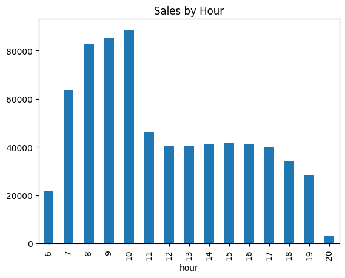
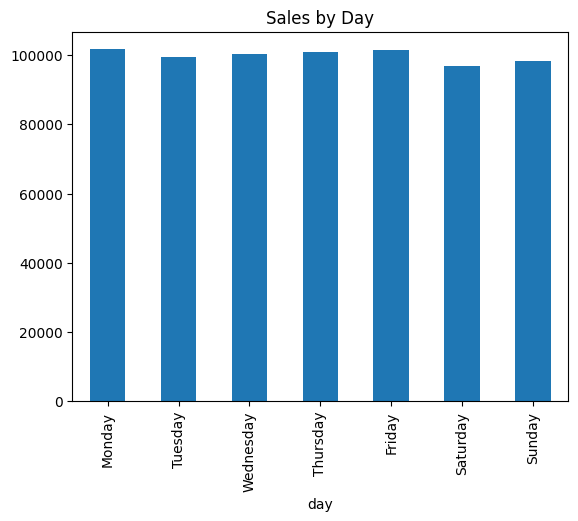
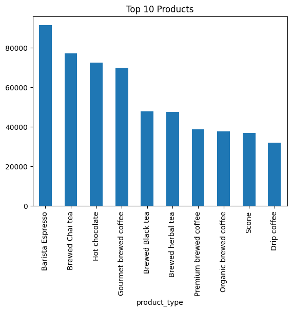

# ☕ Coffee Sales Analysis

## 1. 프로젝트 개요
카페 매출 데이터를 분석하여 시간대별, 요일별, 제품별 매출 패턴을 파악하고,
이를 기반으로 매출 향상 전략을 도출하는 프로젝트입니다.

---

## 2. 데이터 설명
- transaction_date: 거래 날짜
- transaction_time: 거래 시간
- transaction_qty: 판매 수량
- unit_price: 제품 가격
- product_category: 제품 카테고리
- product_type: 제품 유형
- product_detail: 제품 상세

---

## 3. 분석 내용

### 3.1 시간대별 매출 분석

- 오전 8~10시 매출이 가장 높으며, 10시에 피크 발생
- 이후 11시부터 매출 급감
- 저녁 시간대 매출 감소

### 3.2 요일별 매출 분석

- 요일별 매출 차이는 크지 않으며 전반적으로 유사한 수준 유지
- 특정 요일에 매출이 집중되는 현상은 확인되지 않음

### 3.3 제품별 매출 분석

- Barista Espresso가 가장 높은 매출 기록
- Tea 및 Hot Chocolate 제품도 높은 매출 기여

---

## 4. 주요 인사이트

- 출근 시간대 중심의 매출 구조
- 특정 인기 제품에 매출 집중 현상
- 요일보다 시간대가 매출에 더 큰 영향을 미침
- 비수기 시간대(11~14시) 매출 기회 존재
- 저녁 시간대 수요 부족

---

## 5. 개선 제안

- 출근 시간대 운영 최적화 (빠른 주문 시스템, 테이크아웃 강화)
- 점심 시간대 할인 및 세트 상품 구성
- 인기 제품 기반 세트 메뉴 구성
- 저매출 시간대 및 제품 개선 전략 필요

---

## 6. 기술 스택
- Python
- Pandas
- Matplotlib

---

## 7. 회고
데이터 분석을 통해 단순 매출 집계가 아닌, 실제 비즈니스 의사결정에 활용 가능한 인사이트를 도출하는 경험을 할 수 있었습니다.
특히 요일보다 시간대가 매출에 더 큰 영향을 미친다는 점을 확인하며, 데이터 기반 문제 해결의 중요성을 느낄 수 있었습니다.